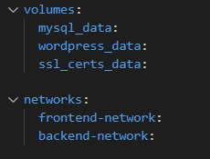

# iaw-practica-14-1
Practica 14-1

Voy a hacer una especie de introduccion de que va la practica. Estamos creandonos una instancia en la que en esa misma instancia vamos a usar docker para poder usar los contenedores y poder tener en una misma maquina instalado mysql, wordpress, phpmyadmin y el certificado.
Esto se dividira en redes y volumenes.

Para explicar practica vamos a dividirla en varios pasos:

**Paso 1:**
Vamos a crearnos una instancia con terraform, a esta maquina le vamos a añadir el grupo de seguridad y una ip elastica(esto esta explicado en las anteriores practicas). 

Muestro el grupo de seguridad:

Muestro la creacion de la instancia y de la ip elastica:

**Paso 2**
Hay que instalarnos docker y docker compose, para esto vamos a utilizar ansible:

Ahora vamos a añadir los paquetes de python para docker y movemos el directorio a la instancia:

**Paso 3**

Ahora tenemos que crearnos los contenedores, los volumenes y las redes en nuestra instancia.
Para esto vamos a usar la pagina docker hub para usar las imagines oficiales de las que vamos a usar.
En nuestro caso nos pide la practica usar las imagenes de phpmyadmin, wordpress, mysql y https-service.

Para wordpress:

Para mysql:

Para phpmyadmin:

Para https-portal(este seria el certificado como certbot):

Ahora muestro los volumenes y las redes:

Recordatorio= Para poder ejecutar docker compose hay que instalarse en nuestra maquina:

Las variables usadas son:

**Paso 4** 

Hay que asignar a nuestra ip un dominio, en mi caso he usado la pagina de noip.com:

Esto hay que añadirlo en nuestro https-portal.

**Paso 5**

Comprobamos que funciona, para esto vamos a poner nuestro dominio en nuestro navegador:

Y seguimos los pasos hasta llegar a nuestro wordpress:

